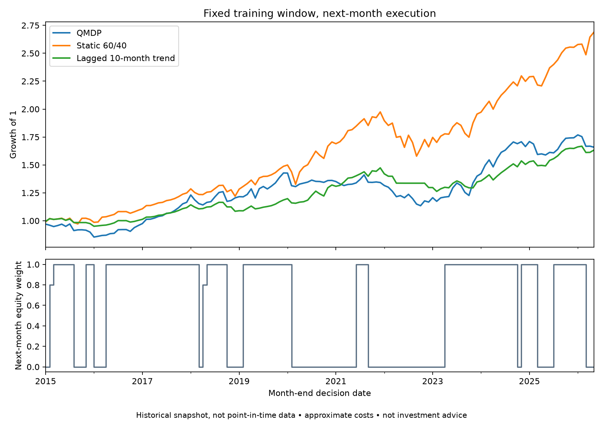

# Regime-switching allocation: a reproducible audit

ENGS 177, Dartmouth, Spring 2026. Dario Blanco Morales, Even Hogberget,
Kyle David Ledda-Lewaren, and Taka Khoo. Instructor: Wesley Marrero.

An offline research example: fit a Gaussian HMM to VIX and the Treasury term
spread, filter regime beliefs, and choose equity/bond weights from a discrete
reward table. **Not investment advice or a trading system.**

## What the corrected experiment actually shows



| 2015-01 through 2026-05, cached historical snapshot | CAGR | Sharpe, zero risk-free rate | Max drawdown |
|---|---:|---:|---:|
| QMDP / equivalent myopic reward rule | 4.53% | 0.51 | −20.52% |
| Monthly static 60/40 | 9.05% | 0.93 | −20.05% |
| Lagged 10-month trend, half capital per asset or cash | 4.39% | 0.74 | −14.30% |

The regime policy **does not beat 60/40** in this corrected diagnostic. These
are descriptive results for one fixed configuration, not a statistical claim.
[Metrics and data hash](results/chronological/metrics.json),
[monthly returns](results/chronological/monthly_net_returns.csv), and
[dated signals and beliefs](results/chronological/end_of_month_signals.csv) are committed.

## Reproduce without downloading data

Python 3.13, CPU, no credentials or pickle loading:

```sh
python3.13 -m venv .venv
source .venv/bin/activate
pip install -r requirements-reproduce.txt
OPENBLAS_NUM_THREADS=1 OMP_NUM_THREADS=1 python -m pytest -q
OPENBLAS_NUM_THREADS=1 OMP_NUM_THREADS=1 python reproduce_chronological.py
```

CI runs both commands and uploads fresh results. Numerical tolerance, rather
than binary-identical plots, is expected across BLAS/platform versions.

### Timing and assumptions

- HMM, scaling, and empirical CRRA reward estimates use **2003-10 through
  2014-12 only**. Two states, five training-likelihood restarts, seed 7,
  gamma 2, discount .95, six long-only equity/bond allocations. No evaluation
  return is used to fit the reward table or choose hyperparameters.
- A forward-only log-domain filter observes month t. Its transition forecast
  chooses weights for month t+1. Returns are converted from per-asset log
  returns to simple returns **before** aggregation and compounding.
- All strategies enter from cash at the same evaluation boundary. Cost is
  5 bps per L1 target-weight change, including entry; it is approximate, not
  drift-adjusted. Idle cash earns zero. Dividends/adjustments follow the
  committed price-derived data, not a freshly validated market feed.
- The cached CSV is **not a point-in-time vintage dataset**. Month-end signal
  availability, data revisions, execution slippage, taxes, and statistical
  significance are not modeled. Chronological code alone does not establish
  live investability. No present-day performance claim is made.

### An important structural result

Here all actions share the same transition matrix, rewards are additive, and
the state has no previous holdings or wealth. The QMDP continuation term is
therefore identical across actions: its argmax equals the myopic expected
reward argmax. The experiment checks this equality. Transaction costs are
evaluated after decisions, **not optimized** by this state representation.
This is a useful hidden-regime filtering example, not evidence that a complex
sequential planner adds value. Holdings-dependent costs would require a richer model.

## Correctness fixes and regression checks

- Bellman contraction now sums over **all successor states**, not only the
  transition diagonal; exact policy iteration and value iteration agree.
- Stationary distributions no longer depend on an eigenvector's arbitrary
  sign. Non-unique distributions fail explicitly. Log filtering handles
  emissions too small to represent directly.
- Weight application is lagged, log-return conversion is explicit, and
  drawdown includes the initial capital (including a first-period loss).
- Future-perturbation tests verify that changing evaluation observations and
  returns cannot alter model fitting or preceding signals.
- The historical walk-forward helper also freezes scaling between refits,
  removes a full-sample fallback, converts training returns, and uses the
  corrected Bellman sum. That larger comparison has **not** been rerun.

## Original course work and provenance

The original [project notes](HISTORICAL_README.md), reports, slides, and legacy
experiment outputs remain for provenance. Their old headline Sharpe/drawdown
claims are **withdrawn**, not reproduced: fitting/evaluation windows overlapped,
some rewards used full-sample returns, signals were applied to same-month
returns, and log returns were treated as simple returns. Historical scripts
other than the tested reproduction path are not validated benchmarks.

The new diagnostic replaces those claims; it does not retroactively change
the submitted team report or suggest that all old figures are corrected.
